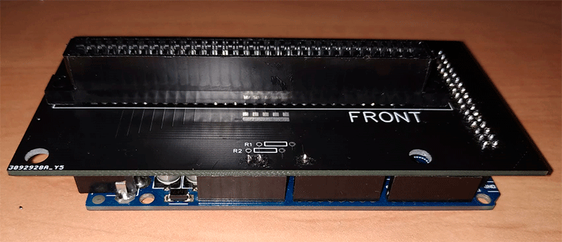
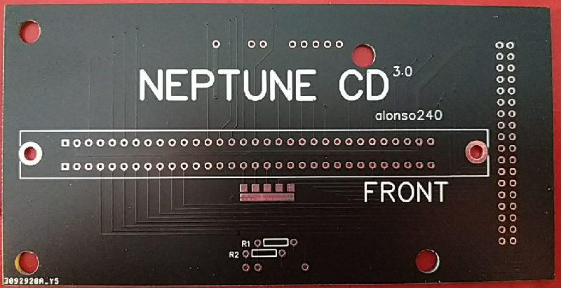

# GenDump

GenDump es un proyecto para volcar la memoria de cartuchos de Sega Genesis (Mega Drive) y Sega 32X (Mega Drive 32X) usando Arduino Mega.  
Permite leer y guardar el contenido del cartucho a través de comandos seriales.

## Características

- Comunicación por puerto serie
- Detección automática de cartucho insertado
- Comandos para volcado, lectura de dirección y cabecera

### Mejoras pendientes

- Más velocidad de volcado.
- Lectura y escritura de partidas guardadas.
- Lectura de cartuchos combinados (Sonic & Knuckles)

## Hardware

El hardware está basado en el proyecto [Mega Mega Dumper](https://www.sodnpoo.com/posts.xml/mega_mega_dumper.xml)

### Partes

- ARDUINO MEGA


- SHIELD PARA ARDUINO MEGA


[Descargar Gerber GenDump](Shield/Gerber%20GenDump.zip)

- SLOT DE SEGA GENESIS (MEGA DRIVE)


- 1 RESISTENCIA DE 4K7


- 47 PINES


### Aspecto de la Shield






## Comunicación Serial

### Configuración

- Tasa de baudios: 115200

### Comandos para comunicarse con GenDump

- `#` : Inicia el volcado completo del cartucho
- `A` : Consulta si hay cartucho insertado
- `@NÚMERO` : Lee la dirección "NÚMERO" del cartucho
- `I` : Muestra la versión del programa
- `_C` : Muestra la cabecera del cartucho

## Funcionamiento

### Pines de los cartuchos

Debemos saber el nombre de los pines de los cartuchos y que función tiene cada uno.
Así podemos configurar las direcciones y leer los valores.


#### Pines

| PIN TRASERO | FUNCION  | PIN DELANTERO | FUNCION |
|-------------|----------|---------------|---------|
| A1          | GND      | B1            | SL1     |
| A2          | VCC      | B2            | MRES    |
| A3          | VA8      | B3            | SR1     |
| A4          | VA11     | B4            | VA9     |
| A5          | VA7      | B5            | VA10    |
| A6          | VA12     | B6            | VA18    |
| A7          | VA6      | B7            | VA19    |
| A8          | VA13     | B8            | VA20    |
| A9          | VA5      | B9            | VA21    |
| A10         | VA14     | B10           | VA22    |
| A11         | VA4      | B11           | VA23    |
| A12         | VA15     | B12           | /YS     |
| A13         | VA3      | B13           | /VSYNC  |
| A14         | VA16     | B14           | /HSYNC  |
| A15         | VA2      | B15           | EDCLK   |
| A16         | VA17     | B16           | /CAS0   |
| A17         | VA1      | B17           | /CE_0   |
| A18         | GND      | B18           | /AS     |
| A19         | VD7      | B19           | VCLK    |
| A20         | VD0      | B20           | /DTACK  |
| A21         | VD8      | B21           | /CAS2   |
| A22         | VD6      | B22           | VD15    |
| A23         | VD1      | B23           | VD14    |
| A24         | VD9      | B24           | VD13    |
| A25         | VD5      | B25           | VD12    |
| A26         | VD2      | B26           | /ASEL   |
| A27         | VD10     | B27           | /VRES   |
| A28         | VD4      | B28           | /LWR    |
| A29         | VD3      | B29           | /UWR    |
| A30         | VD11     | B30           | /M3     |
| A31         | VCC      | B31           | /TIME   |
| A32         | GND      | B32           | /CART   |

##### Funciones

| FUNCION    | DESCRIPCION                                                  |
|------------|--------------------------------------------------------------|
| /M3        | Dejar flotando para el modo Mega Drive                       |
| /CART      | GND si hay cartucho insertado                                |
| VD0 - VD15 | Bus de datos                                                 |
| VA1 - VA23 | Bus de direcciones                                           |
| /CE_0      | Chip habilitado para $000000 - $3FFFFF                       |
| /TIME      | Chip habilitado para $A13000 - $A130FF                       |
| /UWR       | Escribir enable para el byte superior de una palabra         |
| /LWR       | Escribir enable para el byte inferior de una palabra         |
| /CAS0      | Chip habilitado para $000000 - $DFFFFF                       |
| /CAS2      | Luz estroboscópica de dirección de columna para DRAM         |
| /ASEL      | Control múltiplex de direcciones de file / columna para DRAM |
| /DTACK     | 68000 Reconocimiento de datos                                |
| /AS        | Luz estroboscópica de direcciones 68000                      |
| VCLK       | Reloj 68000                                                  |
| EDCLK      | Reloj de vídeo H40                                           |
| /VSYNC     | Sincronización verical de la señal de vídeo                  |
| /HSYNC     | Sincronización horizontal de la señal de vídeo               |
| /YS        | Se afirma al generar el color de fondo                       |
| SL1        | Entrada de audio analógica (altavoz izquierdo)               |
| SR1        | Entrada de audio analógica (altavoz derecho)                 |
| /MRES      | Reseteo completo (por ejemplo, botón de encendido)           |
| /VRES      | Reseteo parcial (por ejemplo, botón de reinicio)             |


### Pines Arduino

Cada pin de los cartuchos irán a un pin de la placa Arduino.
Hay varios pines del cartucho que van a GND, pero no estoy seguro si deberían estar conectados a pines de Arduino para poder manejar la lectura de memoria u otras funciones.


#### Pines

Cada pin del cartucho se conecta a un pin de la placa Arduino.

| PIN TRASERO | ARDUINO  | PIN DELANTERO | ARDUINO    |
|-------------|----------|---------------|------------|
| A1          | GND      | B1            |            |
| A2          | 5V       | B2            |            |
| A3          | 8        | B3            |            |
| A4          | 9        | B4            | 53         |
| A5          | 23       | B5            | 51         |
| A6          | 25       | B6            | 49         |
| A7          | 27       | B7            | 47         |
| A8          | 6        | B8            | 45         |
| A9          | 5        | B9            | 43         |
| A10         | 4        | B10           | 41         |
| A11         | 3        | B11           | 39         |
| A12         | 2        | B12           |            |
| A13         | 29       | B13           |            |
| A14         | 31       | B14           |            |
| A15         | 33       | B15           |            |
| A16         | 35       | B16           | OE (GND)   |
| A17         | 37       | B17           | CS (GND)   |
| A18         | GND      | B18           | AS (GND)   |
| A19         | 36       | B19           |            |
| A20         | 38       | B20           |            |
| A21         | 40       | B21           |            |
| A22         | 42       | B22           | 46         |
| A23         | 44       | B23           | 48         |
| A24         | 34       | B24           | 50         |
| A25         | 32       | B25           | 52         |
| A26         | 30       | B26           |            |
| A27         | 28       | B27           | RESET (GND)|
| A28         | 26       | B28           | WE (GND)   |
| A29         | 24       | B29           |            |
| A30         | 22       | B30           |            |
| A31         | 5V       | B31           |            |
| A32         | GND      | B32           | A0*        |

*Si recibe GND es que hay un cartucho insertado.

### Funcionamiento de la placa

Para que GenDump funcione, debe recibir comandos.
Los comandos se deben enviar por el puerto serial.

- `#` : Inicia el volcado completo del cartucho
- `_C` : Muestra la cabecera del cartucho

#### Comando "I"

Este comando consulta la versión del programa.

Cuando GenDump recibe el comando, envía la versión de GenDump.

#### Comando "A"

Este comando consulta si hay un cartucho insertado.

Cuando GenDump recibe el comando, envía un "1" si hay un cartucho insertado y un "0" si no lo hay.

#### Comando "@NÚMERO"

Este comando lee el código del cartucho según la dirección "NÚMERO".

Cuando GenDump recibe el comando, envía el código hexadecimal del cartucho.

La dirección debe ser un número entero.

#### Comando "_C"

Este comando muestra la cabecera del cartucho.

Cuando GenDump recibe el comando, envía la cabecera del cartucho en formato hexadecimal.

Al final del comando se envía "_CABECERA_".

Los datos de la cabecera se reparten así:

<table>
  <tr>
    <th>DIRECCIÓN</th>
    <th>0</th>
    <th>1</th>
    <th>2</th>
    <th>3</th>
    <th>4</th>
    <th>5</th>
    <th>6</th>
    <th>7</th>
    <th>8</th>
    <th>9</th>
    <th>A</th>
    <th>B</th>
    <th>C</th>
    <th>D</th>
    <th>E</th>
    <th>F</th>
  </tr>
  <tr>
    <td>100</td>
    <td colspan="16">HARDWARE</td>
  </tr>
  <tr>
    <td>110</td>
    <td colspan="16">COMPAÑÍA, FECHA</td>
  </tr>
  <tr>
    <td>120</td>
    <td colspan="16">NOMBRE LOCAL</td>
  </tr>
  <tr>
    <td>130</td>
    <td colspan="16">NOMBRE LOCAL</td>
  </tr>
  
  <tr>
    <td>140</td>
    <td colspan="16">NOMBRE LOCAL</td>
  </tr>
  <tr>
    <td>150</td>
    <td colspan="16">NOMBRE INTERNACIONAL</td>
  </tr>
  <tr>
  <tr>
    <td>160</td>
    <td colspan="16">NOMBRE INTERNACIONAL</td>
  </tr>
  <tr>
  <tr>
    <td>170</td>
    <td colspan="16">NOMBRE INTERNACIONAL</td>
  </tr>
  <tr>
    <td>180</td>
    <td colspan="13">ID</td>
    <td colspan="3">CHECKSUM</td>
  </tr>
  <tr>
    <td>190</td>
    <td colspan="16">E/S</td>
  </tr>
  <tr>
    <td>1A0</td>
    <td colspan="4">DIR. ROM MIN.</td>
    <td colspan="4">DIR. ROM MAX.</td>
    <td colspan="4">DIR. RAM MIN.</td>
    <td colspan="4">DIR. RAM MAX.</td>
  </tr>
  <tr>
    <td>1B0</td>
    <td colspan="12">EXTERNAL RAM DATA</td>
    <td colspan="4">MODEM INFO</td>
  </tr>
   <tr>
    <td>1C0</td>
    <td colspan="8">MODEM INFO</td>
  </tr>
  
   <tr>
    <td>1D0</td>
    <td colspan="16"></td>
  </tr>
   <tr>
    <td>1E0</td>
    <td colspan="16"></td>
  </tr>
  
   <tr>
    <td>1F0</td>
    <td colspan="16">REGIÓN</td>
  </tr>
</table>


																
| DIRECCIÓN | 0	| 1	| 2	| 3	| 4	| 5	| 6	| 7	| 8	| 9	| A	| B	| C	| D	| E	| F	|
|-----------|---|---|---|---|---|---|---|---|---|---|---|---|---|---|---|---|
| 100	    |                          HARDWARE     	                    |														
| 110       |	                    COMPAÑÍA, FECHA							|								
120	NOMBRE LOCAL															
130																
140																
150	NOMBRE INTERNACIONAL															
160																
170																
180	ID													CHECKSUM		
190	E/S															
1A0	DIR. ROM MIN.				DIR. ROM MAX.				DIR. RAM MIN.				DIR. RAM MAX.			
1B0	EXTERNAL RAM DATA												MODEM INFO			
1C0	MODEM INFO								VACIO							
1D0	VACIO															
1E0																
1F0	REGIÓN															
																


## Instalación

1. Clona el repositorio:
   ```bash
   git clone https://github.com/alonso240/GenDump.git
   ```
2. Abre el proyecto en PlatformIO o Arduino IDE.
3. Compila y sube el código al Arduino Mega.

## Créditos

- alonso240
- Luiti

---

> **Nota:**  
> Para mostrar imágenes, colócalas en la carpeta `images` dentro del repositorio y usa la sintaxis ``.  
> Si usas enlaces externos, reemplaza la ruta por la URL directa.
