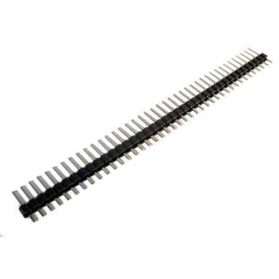
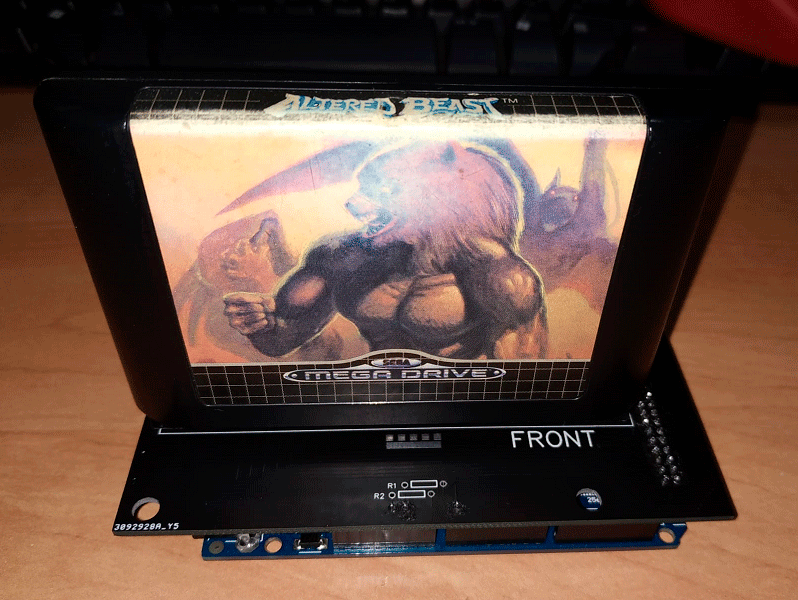
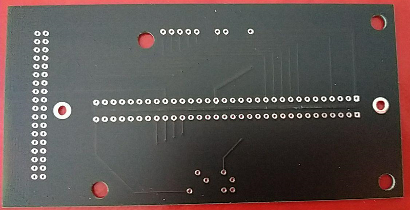
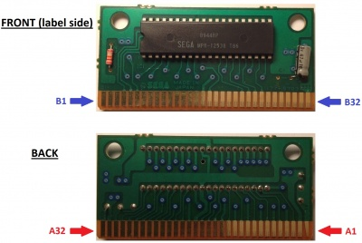

# GenDump

GenDump is a project to dump the memory of Sega Genesis (Mega Drive) and Sega 32X (Mega Drive 32X) cartridges using Arduino Mega.  
It allows you to read and save the cartridge content through serial commands.

## Features

- Serial port communication
- Automatic detection of inserted cartridge
- Commands for dumping, address reading, and header reading

### Pending improvements

- Faster dumping speed
- Reading and writing save games
- Reading combined cartridges (Sonic & Knuckles)

## Hardware

The hardware is based on the [Mega Mega Dumper](https://www.sodnpoo.com/posts.xml/mega_mega_dumper.xml) project.

### Parts

- ARDUINO MEGA  

- SHIELD FOR ARDUINO MEGA  

[Download Gerber GenDump](Shield/Gerber%20GenDump.zip)

- SEGA GENESIS (MEGA DRIVE) SLOT  

- 1 RESISTOR 4K7  

- 47 PINS  

### Shield appearance

## Serial Communication

### Configuration

- Baud rate: 115200

### Commands to communicate with GenDump

- `#` : Starts the full cartridge dump
- `A` : Checks if a cartridge is inserted
- `@NUMBER` : Reads the "NUMBER" address from the cartridge
- `I` : Shows the program version
- `_C` : Shows the cartridge header

## Operation

### Cartridge pins

You need to know the name and function of each cartridge pin to configure addresses and read values.

#### Pins

| REAR PIN | FUNCTION  | FRONT PIN | FUNCTION |
|----------|-----------|-----------|----------|
| A1       | GND       | B1        | SL1      |
| A2       | VCC       | B2        | MRES     |
| A3       | VA8       | B3        | SR1      |
| A4       | VA11      | B4        | VA9      |
| A5       | VA7       | B5        | VA10     |
| A6       | VA12      | B6        | VA18     |
| A7       | VA6       | B7        | VA19     |
| A8       | VA13      | B8        | VA20     |
| A9       | VA5       | B9        | VA21     |
| A10      | VA14      | B10       | VA22     |
| A11      | VA4       | B11       | VA23     |
| A12      | VA15      | B12       | /YS      |
| A13      | VA3       | B13       | /VSYNC   |
| A14      | VA16      | B14       | /HSYNC   |
| A15      | VA2       | B15       | EDCLK    |
| A16      | VA17      | B16       | /CAS0    |
| A17      | VA1       | B17       | /CE_0    |
| A18      | GND       | B18       | /AS      |
| A19      | VD7       | B19       | VCLK     |
| A20      | VD0       | B20       | /DTACK   |
| A21      | VD8       | B21       | /CAS2    |
| A22      | VD6       | B22       | VD15     |
| A23      | VD1       | B23       | VD14     |
| A24      | VD9       | B24       | VD13     |
| A25      | VD5       | B25       | VD12     |
| A26      | VD2       | B26       | /ASEL    |
| A27      | VD10      | B27       | /VRES    |
| A28      | VD4       | B28       | /LWR     |
| A29      | VD3       | B29       | /UWR     |
| A30      | VD11      | B30       | /M3      |
| A31      | VCC       | B31       | /TIME    |
| A32      | GND       | B32       | /CART    |

##### Functions

| FUNCTION   | DESCRIPTION                                                 |
|------------|-------------------------------------------------------------|
| /M3        | Leave floating for Mega Drive mode                          |
| /CART      | GND if cartridge is inserted                                |
| VD0 - VD15 | Data bus                                                    |
| VA1 - VA23 | Address bus                                                 |
| /CE_0      | Chip enabled for $000000 - $3FFFFF                          |
| /TIME      | Chip enabled for $A13000 - $A130FF                          |
| /UWR       | Write enable for upper byte of a word                       |
| /LWR       | Write enable for lower byte of a word                       |
| /CAS0      | Chip enabled for $000000 - $DFFFFF                          |
| /CAS2      | Strobe light for DRAM column address                        |
| /ASEL      | Multiplexed address control for DRAM row/column             |
| /DTACK     | 68000 Data acknowledge                                      |
| /AS        | 68000 Address strobe                                        |
| VCLK       | 68000 Clock                                                 |
| EDCLK      | H40 video clock                                             |
| /VSYNC     | Vertical sync of video signal                               |
| /HSYNC     | Horizontal sync of video signal                             |
| /YS        | Asserted when generating background color                   |
| SL1        | Analog audio input (left speaker)                           |
| SR1        | Analog audio input (right speaker)                          |
| /MRES      | Full reset (e.g., power button)                             |
| /VRES      | Partial reset (e.g., reset button)                          |

### Arduino pins

Each cartridge pin is connected to a pin on the Arduino board.
Several cartridge pins go to GND, but it's not clear if they should be connected to Arduino pins to handle memory reading or other functions.

#### Pins

Each cartridge pin connects to a pin on the Arduino board.

| REAR PIN | ARDUINO  | FRONT PIN | ARDUINO    |
|----------|----------|-----------|------------|
| A1       | GND      | B1        |            |
| A2       | 5V       | B2        |            |
| A3       | 8        | B3        |            |
| A4       | 9        | B4        | 53         |
| A5       | 23       | B5        | 51         |
| A6       | 25       | B6        | 49         |
| A7       | 27       | B7        | 47         |
| A8       | 6        | B8        | 45         |
| A9       | 5        | B9        | 43         |
| A10      | 4        | B10       | 41         |
| A11      | 3        | B11       | 39         |
| A12      | 2        | B12       |            |
| A13      | 29       | B13       |            |
| A14      | 31       | B14       |            |
| A15      | 33       | B15       |            |
| A16      | 35       | B16       | OE (GND)   |
| A17      | 37       | B17       | CS (GND)   |
| A18      | GND      | B18       | AS (GND)   |
| A19      | 36       | B19       |            |
| A20      | 38       | B20       |            |
| A21      | 40       | B21       |            |
| A22      | 42       | B22       | 46         |
| A23      | 44       | B23       | 48         |
| A24      | 34       | B24       | 50         |
| A25      | 32       | B25       | 52         |
| A26      | 30       | B26       |            |
| A27      | 28       | B27       | RESET (GND)|
| A28      | 26       | B28       | WE (GND)   |
| A29      | 24       | B29       |            |
| A30      | 22       | B30       |            |
| A31      | 5V       | B31       |            |
| A32      | GND      | B32       | A0*        |

*If it receives GND, a cartridge is inserted.

### Board operation

To use GenDump, you must send commands via the serial port.

#### - Command "I"

This command checks the program version.

When GenDump receives the command, it sends the GenDump version.

#### - Command "A"

This command checks if a cartridge is inserted.

When GenDump receives the command, it sends "1" if a cartridge is inserted and "0" if not.

#### - Command "@NUMBER"

This command reads the cartridge code at the "NUMBER" address.

When GenDump receives the command, it sends the cartridge's hexadecimal code.

The address must be an integer.

#### - Command "_C"

This command shows the cartridge header.

When GenDump receives the command, it sends the cartridge header in hexadecimal format.

At the end of the command, `_CABECERA_` is sent.

The header data is distributed as follows:

<table>
  <tr>
    <th>ADDRESS</th>
    <th>0</th>
    <th>1</th>
    <th>2</th>
    <th>3</th>
    <th>4</th>
    <th>5</th>
    <th>6</th>
    <th>7</th>
    <th>8</th>
    <th>9</th>
    <th>A</th>
    <th>B</th>
    <th>C</th>
    <th>D</th>
    <th>E</th>
    <th>F</th>
  </tr>
  <tr>
    <td>100</td>
    <td colspan="16">HARDWARE</td>
  </tr>
  <tr>
    <td>110</td>
    <td colspan="16">COMPANY, DATE</td>
  </tr>
  <tr>
    <td>120</td>
    <td colspan="16">LOCAL NAME</td>
  </tr>
  <tr>
    <td>130</td>
    <td colspan="16">LOCAL NAME</td>
  </tr>
  <tr>
    <td>140</td>
    <td colspan="16">LOCAL NAME</td>
  </tr>
  <tr>
    <td>150</td>
    <td colspan="16">INTERNATIONAL NAME</td>
  </tr>
  <tr>
    <td>160</td>
    <td colspan="16">INTERNATIONAL NAME</td>
  </tr>
  <tr>
    <td>170</td>
    <td colspan="16">INTERNATIONAL NAME</td>
  </tr>
  <tr>
    <td>180</td>
    <td colspan="13">ID</td>
    <td colspan="3">CHECKSUM</td>
  </tr>
  <tr>
    <td>190</td>
    <td colspan="16">I/O</td>
  </tr>
  <tr>
    <td>1A0</td>
    <td colspan="4">ROM MIN ADDR.</td>
    <td colspan="4">ROM MAX ADDR.</td>
    <td colspan="4">RAM MIN ADDR.</td>
    <td colspan="4">RAM MAX ADDR.</td>
  </tr>
  <tr>
    <td>1B0</td>
    <td colspan="12">EXTERNAL RAM DATA</td>
    <td colspan="4">MODEM INFO</td>
  </tr>
   <tr>
    <td>1C0</td>
    <td colspan="8">MODEM INFO</td>
  </tr>
   <tr>
    <td>1D0</td>
    <td colspan="16"></td>
  </tr>
   <tr>
    <td>1E0</td>
    <td colspan="16"></td>
  </tr>
   <tr>
    <td>1F0</td>
    <td colspan="16">REGION</td>
  </tr>
</table>

#### - Command "#"

This command starts the dumping process of the inserted cartridge.

GenDump will send packets every 64 addresses (to avoid saturating the Arduino Mega's RAM) in hexadecimal format.

You will know the process is finished when the packet contains the final text `_FINDUMP_`.

If any packet contains the text `_CANCELAR_`, the process will be canceled.

## Credits

- alonso240
- Luiti